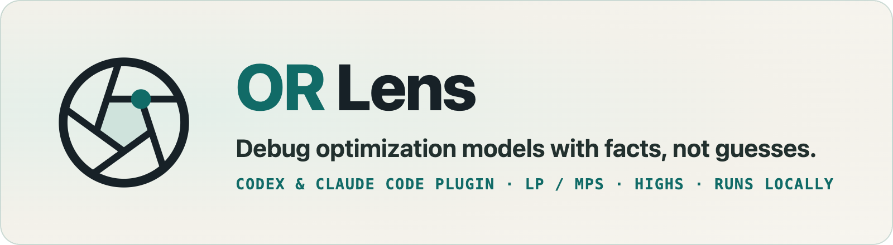
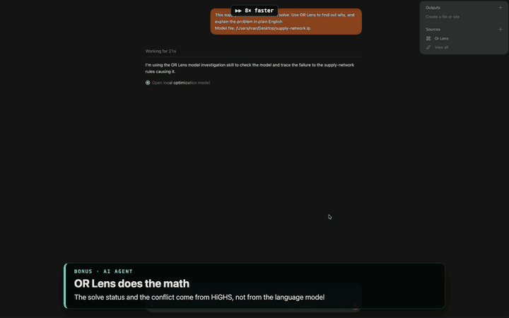

<p align="center">
  <picture>
    <source media="(prefers-color-scheme: dark)" srcset="assets/banner-dark.png">
    
  </picture>
</p>

<p align="center">
  <a href="#install-in-codex"></a>
  <a href="#install-in-claude-code"></a>
  
  <a href="LICENSE"></a>
</p>

OR Lens helps you understand LP and MPS optimization models from a chat with
Codex or Claude: why a model is infeasible, where coefficient ranges are wide,
how rows and columns group into families, and how HiGHS solves it. It runs on
your computer, so model files, matrices and solves stay local.

<p align="center">
  
</p>
<p align="center">
  <a href="https://github.com/ivs-rodin/or-lens-plugin/releases/download/v0.2.1/or-lens-demo.mp4">Full two-minute demo with sound (MP4)</a>
</p>

## What it does

- **Infeasibility:** every independent source of infeasibility, found by
  [STOLP](https://gitlab.com/tarasov.alexey/stolp), with fixes checked on the
  whole model and guidance for the assistant; or a single conflict (IIS)
  extracted by HiGHS and re-solved independently, shown as the constraints and
  variables involved.
- **Numerics:** coefficient ranges on a log scale and diagnostics labeled as
  facts or heuristics.
- **Structure:** the sparse matrix at any zoom and name-based row and column
  families.
- **Solves:** HiGHS runs with independently validated solutions and comparable
  experiments.

Statuses, conflicts, fixes and objective values come from HiGHS (directly or
through STOLP) and independent checks, not from the language model. Text summaries the assistant reads become part of
the chat.

## Install in Codex

```sh
codex plugin marketplace add ivs-rodin/or-lens-plugin
codex plugin add or-lens@or-lens
```

After adding the marketplace you can also install OR Lens from Plugins in the
ChatGPT desktop app. Start a new chat after installing.

## Install in Claude Code

```sh
claude plugin marketplace add ivs-rodin/or-lens-plugin
claude plugin install or-lens@or-lens
```

Inside a session, use `/plugin marketplace add ivs-rodin/or-lens-plugin` and
then `/plugin install or-lens@or-lens`. The plugin works in the terminal and in
local sessions of the Claude desktop app.

## Use

Ask about a model file on your computer:

> Use OR Lens. Open /full/path/model.lp and explain why it is hard to solve.

The workbench opens beside the chat when the app has a browser panel (Codex, the
Claude desktop app); otherwise the assistant gives you a local link. Select a
block in the matrix and ask about it; solves requested in the chat appear in the
workbench.

## Requirements

- macOS or Linux on arm64 or x86_64. Windows is not supported yet.
- The first start installs `uv` if it is missing and the Python dependencies
  into `~/.cache/or-lens`. It needs network access and can take a few minutes;
  if the first connection times out meanwhile, reconnect OR Lens once it
  finishes (in Claude Code, from `/mcp`).

## Update

```sh
codex plugin marketplace upgrade or-lens
```

```sh
claude plugin marketplace update or-lens
```

## License

MIT, see [LICENSE](LICENSE). Third-party components bundled into the workbench
UI are listed with their licenses in
[plugins/or-lens/THIRD_PARTY_NOTICES.md](plugins/or-lens/THIRD_PARTY_NOTICES.md).
